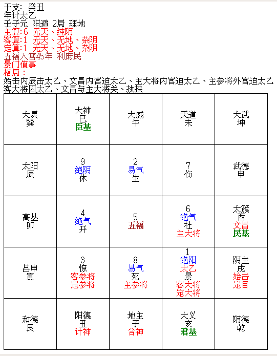
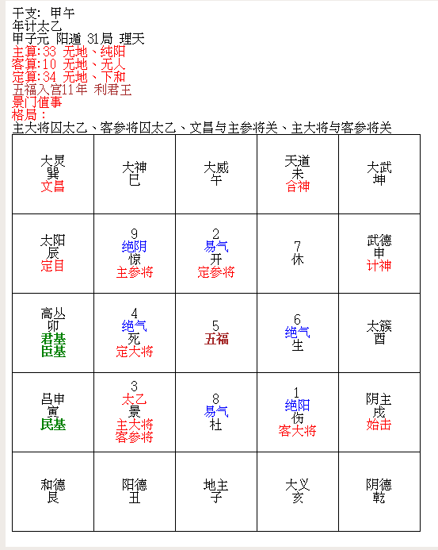
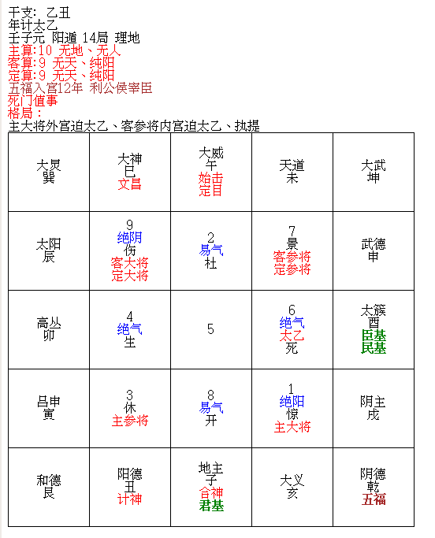

# 明三才以推天地人术[^1]
　　经曰：天地初形，人物既著，三才奠焉。三才者，太乙之元气也，有天、有地、有人焉。天不以高大胜于地，地不以广厚胜于人，人不以为而小于天地[^2]，其数差殊，要其至也[^3]，是以圣人经以三才而太极云[^4]，纬以八卦而太极复[^6]，一经一纬，万物备焉。

　　经曰：算中无十者为无天也，当此之时，天有变异，二曜亏蚀，五纬失行，彗孛飞流，霜雹为沴，此谓算得一、二、三、四、五、六、七、八、九为无天之算也。

　　唐宗景福二年癸丑岁[^7]，太乙入第五纪壬子元第二局，太乙在乙宫[^8]，文昌在太簇，主算得单六，为无天之算，天有变[^9]。是年春夏连阴四十余日，四月十七日云开，见彗星长十余丈，起上台中，中台东行入太微垣[^10]，掃大解入天市，经三十七日渐长一倍，后遇阴沉而灭之[^11]，此其验也。

　　** 素键注：**

　　唐昭宗景福二年，公元893年，癸丑

　　景福二年三月，彗見上台。十一月，白氣貫月，北斗、太微[^12]。

　　按《唐書·昭宗本紀》：二年四月乙酉，有彗星入於太微。 按《天文志》：三月，天久陰，至四月乙酉夜，雲稍開，有 彗星於上台，長十餘丈，東行入太微，掃大角，入天市， 經三旬有七日，益長，至二十餘丈，因雲陰不見。十一 月，有白氣如環，貫月，穿北斗，連太微。

　　经曰：算中无五者为无地也，当此之时，地有变异，山崩川竭，地震水湧而生妖恠[^13]，此谓算得一、二、三、四、十一、十二、十三、十四、二十一、二十二、二十三、二十四、三十一、三十二、三十三、三十四为无地之算也。

　　唐太宗贞观八年甲午岁，太乙入第一纪甲子元第三十一局，太乙在三宫，文昌在大炅，主算得三十三，为无地之算，地有变，是以陇右山崩，大蛇屡见，长百余丈，淮南大水，遣使巡察，此其验也。

　　** 素键注：**

　　唐太宗贞观八年，公元634年，甲午

　　八年七月，山东、江淮大水[^14]

　　贞观八年七月，陇右大蛇屡见。蛇，女子之祥；大者，有所象也。又汾州青龙见，吐物在空中，光明如火，堕地地陷，掘之得玄金，广尺，长七寸

　　经曰：算中无一者为无人也，当此之时，人有变异，口舌妖言，更相残害，疾病兵革，迁改流亡，此为算得单十或二十、三十、四十为无人算也。

　　唐辉王天祐二年乙丑岁，太乙入第六纪壬子元第十四局，太乙在六宫，文昌在大神，主算得单十，为无人之算，人有变异。是年梁王朱全忠杀宰相三省官殆尽，流血成川，人民饥困，递相贱残[^15]，死者不可胜数，此其验也[^16]。

　　** 素键注：**

　　唐辉王，即唐哀帝，李柷，乾宁四年（897年），封辉王。

　　天祐（904年-919年）是唐昭宗李晔开始使用的年号，天祐元年八月唐哀帝李柷即位沿用。四年三月李柷禅位于朱温（904年闰四月-907年三月）。共计4年。之后河东、凤翔、淮南仍称天祐年号，碑刻中有用至天祐二十年[^17]

　　此事即“白马之祸”，见“舊唐書/卷20下，本紀第二十下，哀帝，六月戊子朔[^18]”，

　　乐产王佐秘殊云[^19]：天地人三才之数，须视太乙入宫所理之年灾变为验。如得无天之算，天变在太乙理天之岁也[^20]，如得无地之算，地变在太乙理地之岁也[^20]，如得无人之算，人变在太乙理人之岁也。如太乙在天之岁得无天之算者，人君修德，其次修政，其次修杀，其次修根[^21]，则日月无亏，五星无差其度，以消天之变也。太乙在理地之岁，得无地之算者，人君用警火戒[^22]，无兴土木之工，营宫室饰，台榭不役人民，毌妨稼穑，则四序气和，八风顺应，雨雪以时不𠎝[^23]愆其候，以消地之变也。太乙在理人之岁得无人之算者，人君奉天修勒[^24]，夙夜兢戒，进忠良，远谗佞，察狱颂[^25]，恤孤寡，揠兵息民，结和通使，如此则天地气和，年谷丰稔，以消人变之数也。

　　天镜[^26]曰：若算得十六、二十六、三十六[^27]、十七、二十七、三十七、十八、二十八、三十八、十九、二十九、三十九，此皆天地人三才具足之算也。

[^1]：此标题原阙，据“大明嘉靖四十三年甲岁”本，“故宫珍本从刊《太乙数统宗大全》海南出版社”补入

[^2]：“嘉靖四十三年”本作“人不以微小而殊于天地”

[^3]：“嘉靖四十三年”本作“数虽差殊，要其至一也”

[^5]：“嘉靖四十三年”本作“是以圣人经以三才而太极立”

[^6]：“嘉靖四十三年”本“复”字右侧有“分”字，疑作“太极复分”

[^7]：“嘉靖四十三年”本作“唐”昭宗”

[^8]：“嘉靖四十三年本作“太乙在一宫”

[^9]：“嘉靖四十三年”本作“天有变异”

[^10]：“嘉靖四十三年”本作“起上台，东行入太微垣”

[^11]：“嘉靖四十三年”本作“后遇阴沉而灭”

[^12]：[欽定古今圖書集成/曆象彙編/庶徵典/第045卷](https://zh.wikisource.org/wiki/%E6%AC%BD%E5%AE%9A%E5%8F%A4%E4%BB%8A%E5%9C%96%E6%9B%B8%E9%9B%86%E6%88%90/%E6%9B%86%E8%B1%A1%E5%BD%99%E7%B7%A8/%E5%BA%B6%E5%BE%B5%E5%85%B8/%E7%AC%AC045%E5%8D%B7)

[^13]：“恠”同“怪”

[^14]：[新唐书/卷036](https://zh.wikisource.org/zh-hans/%E6%96%B0%E5%94%90%E6%9B%B8/%E5%8D%B7036)

[^15]：“嘉靖四十三年”本作“递相残害”

[^16]：“嘉靖四十三年”本作“此其无人之验也”

[^17]：[天佑二年](https://baike.baidu.com/item/%E5%A4%A9%E7%A5%90%E4%BA%8C%E5%B9%B4/13022901)

[^18]：[舊唐書/卷20下](https://zh.wikisource.org/zh/%E8%88%8A%E5%94%90%E6%9B%B8/%E5%8D%B720%E4%B8%8B)

[^19]：“嘉靖四十三年”本作“乐产王佐秘珠云”，“故宫珍本从刊《太乙数统宗大全》海南出版社”作“乐产秘録云”

[^20]：原文此二处无“也”字，据“嘉靖四十三年”本补入

[^21]：“嘉靖四十三年”本作“人君修德，其次修政，其次修救，其次修禳”

[^22]：“嘉靖四十三年”本作“人君用警天戒”

[^23]：“𠎝”同“愆”

[^24]：“嘉靖四十三年”本作“人若君奉天修德”

[^25]：“嘉靖四十三年”本作“察狱讼”

[^26]：“嘉靖四十三年”本作“金镜”

[^27]：太乙主算算无36此数，根据三才足数的规则，36为三才足数
